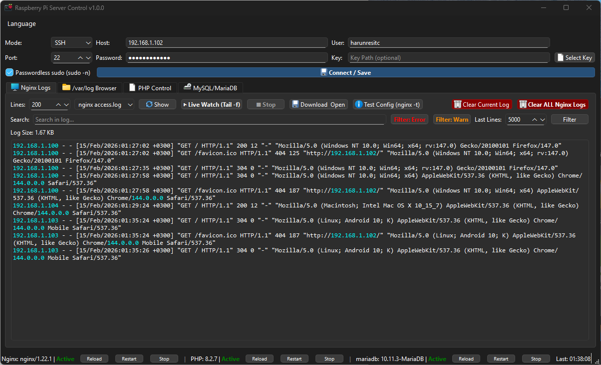
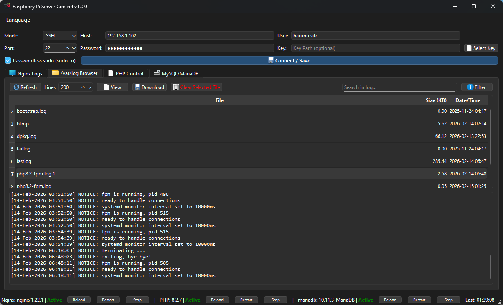
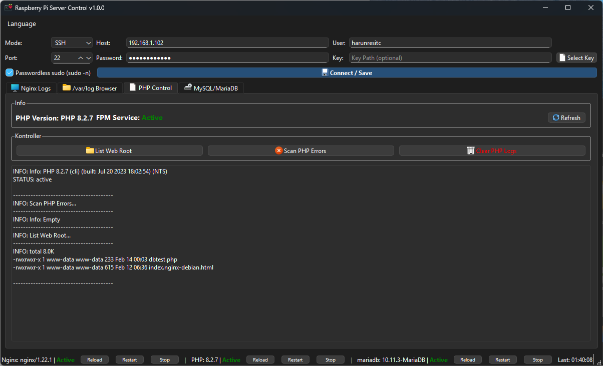
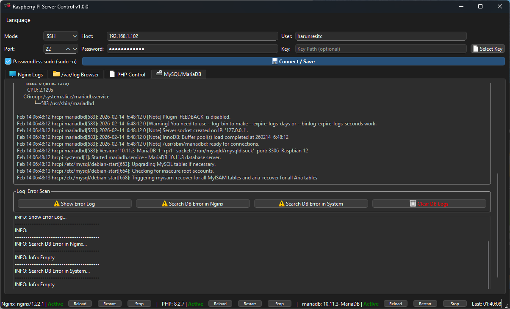

# Raspberry Pi Server Control / Sunucu Yönetim Paneli


[English](#english) | [Türkçe](#türkçe)

---

## English

**Raspberry Pi Server Control** is a comprehensive GUI application designed to manage and monitor your Raspberry Pi (or any Linux server) remotely via SSH or locally. Built with Python and PySide6, it offers a modern, dark-themed interface for controlling Nginx, PHP-FPM, and MySQL/MariaDB services, viewing logs in real-time, and browsing files.

### 🌟 Key Features

*   **Connection Modes:**
    *   **SSH:** Connect to remote servers using password or key-based authentication. Supports `sudo` (passwordless or with password).
    *   **Local:** Run directly on the server for local management.
*   **Service Management:**
    *   **Nginx:** View status/version, Reload, Restart, Stop service. Test configuration (`nginx -t`).
    *   **PHP-FPM:** Auto-detect version, view FPM status, Restart/Reload service. Listing web root and checking PHP error logs.
    *   **MySQL/MariaDB:** Monitor service status, version, port, and socket. View error logs and search for DB errors in system logs.
*   **Log Viewer:**
    *   **Real-time Monitoring:** Watch logs live (like `tail -f`) with color-coded highlighting (Error, Warning, Info).
    *   **Filtering:** Quick filters for Errors/Warnings and custom keyword search.
    *   **File Browser:** integrated `/var/log` browser to view, download, or clear any log file.
*   **Customization:**
    *   **Multi-language:** Full support for **English** and **Turkish**.
    *   **Themes:** Modern dark theme with responsive UI.

### 🚀 Installation & Usage

1.  **Clone the repository:**
    ```bash
    git clone https://github.com/yourusername/RaspberryServerControl.git
    cd RaspberryServerControl
    ```

2.  **Install dependencies:**
    ```bash
    pip install -r requirements.txt
    ```

3.  **Run the application:**
    ```bash
    python main.py
    ```

4.  **Connect:**
    *   Enter your SSH details (Host, User, Password/Key).
    *   Click **Connect / Save**.

---

## Türkçe

**Raspberry Pi Sunucu Kontrol**, Raspberry Pi veya herhangi bir Linux sunucunuzu uzaktan (SSH) veya yerel olarak yönetmek için geliştirilmiş kapsamlı bir masaüstü uygulamasıdır. Python ve PySide6 ile hazırlanan modern arayüzü sayesinde Nginx, PHP ve MySQL servislerini yönetebilir, logları canlı izleyebilir ve sistem durumunu takip edebilirsiniz.

### 🌟 Özellikler

*   **Bağlantı Modları:**
    *   **SSH:** Uzak sunuculara şifre veya SSH anahtarı ile bağlanın. `sudo` desteği mevcuttur.
    *   **Yerel (Local):** Uygulamayı sunucu üzerinde doğrudan çalıştırarak yönetin.
*   **Servis Yönetimi:**
    *   **Nginx:** Durum/sürüm bilgisi, Yeniden Yükle (Reload), Başlat/Durdur. Konfigürasyon testi (`nginx -t`).
    *   **PHP-FPM:** Otomatik sürüm algılama, FPM durumu, Servis yönetimi. PHP hata taraması ve web klasörü listeleme.
    *   **MySQL/MariaDB:** Servis durumu, port ve soket kontrolü. Veritabanı hata loglarını inceleme ve sistem genelinde DB hatası arama.
*   **Log Görüntüleyici:**
    *   **Canlı İzleme:** Logları anlık olarak (`tail -f` benzeri) renkli vurgularla izleyin.
    *   **Filtreleme:** Hata/Uyarı için hızlı filtreler veya özel kelime arama.
    *   **Dosya Tarayıcı:** `/var/log` altındaki tüm dosyaları listeleyin, indirin veya temizleyin.
*   **Özelleştirme:**
    *   **Çoklu Dil:** **Türkçe** ve **İngilizce** dil desteği.
    *   **Tema:** Modern karanlık tema (Dark Theme).

### 🚀 Kurulum ve Kullanım

1.  **Projeyi indirin:**
    ```bash
    git clone https://github.com/kullaniciadiniz/RaspberryServerControl.git
    cd RaspberryServerControl
    ```

2.  **Gerekli kütüphaneleri yükleyin:**
    ```bash
    pip install -r requirements.txt
    ```

3.  **Uygulamayı başlatın:**
    ```bash
    python main.py
    ```

4.  **Bağlanın:**
    *   SSH bilgilerinizi girin (Sunucu, Kullanıcı, Şifre/Anahtar).
    *   **Bağlan / Kaydet** butonuna tıklayın.

---

**License:** MIT License
**Author:** Harun Reşit Çakaltarla (with vibecoding)

---

## Screenshots / Ekran Görüntüleri

| Connection / Bağlantı | Nginx Control / Kontrol |
|:---:|:---:|
|  |  |

| PHP Control / Kontrol | MySQL Control / Kontrol |
|:---:|:---:|
|  |  |

